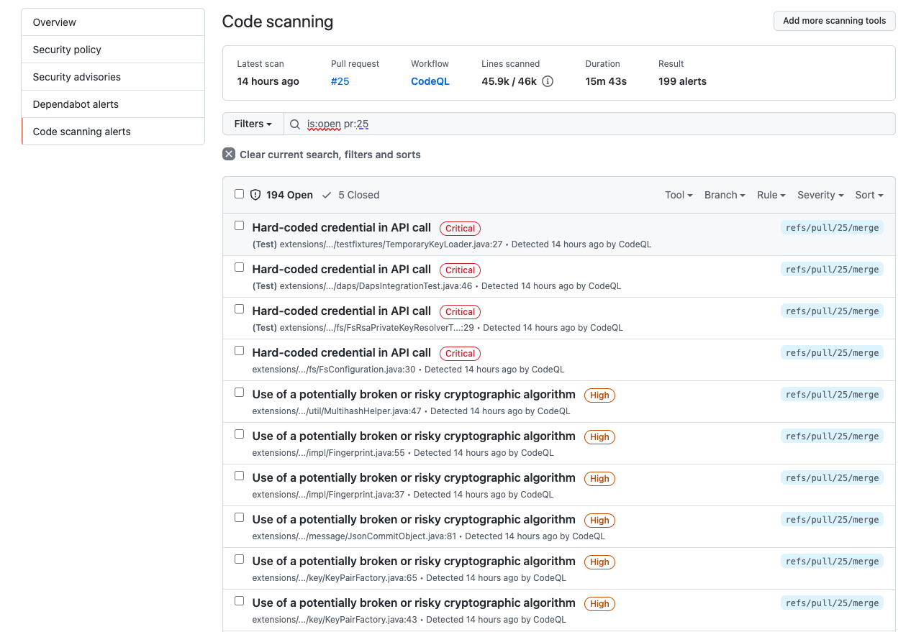
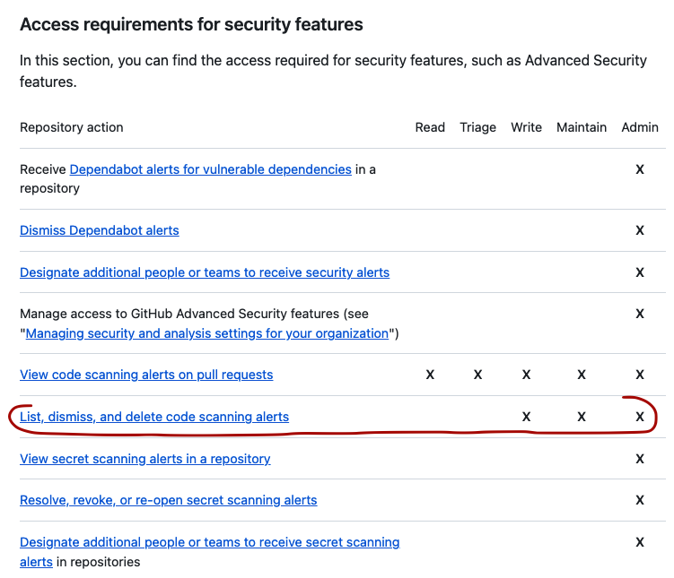

# CodeQL
CodeQL is a semantic code analysis engine developed by GitHub to automate security checks. A database is extracted from source code that can be analysed with a powerful query language. Each single query can be thought of as a “check” or “rule” representing a distinct security vulnerability that is being searched for. There is an available set of standard CodeQL queries, written by GitHub researchers and community contributors, and custom ones can be written too. See [Writing queries](https://codeql.github.com/docs/writing-codeql-queries/codeql-queries/) in the CodeQL docs for more information.

## Extending the scope of CodeQL queries scan
CodeQL is integrated in the EDC CI build in a dedicated [Github workflow](.github/workflows/codeql-analysis.yml).
Currently the workflow runs on PRs and commits to the main branch and runs the default set of queries as provided by CodeQL.

To have more detailed scan we decided to extend the CodeQL queries, by using the built in CodeQL query suite: [security-and-quality](https://docs.github.com/en/code-security/code-scanning/automatically-scanning-your-code-for-vulnerabilities-and-errors/configuring-code-scanning#using-queries-in-ql-packs).

```yaml
      # Initializes the CodeQL tools for scanning.
      - name: Initialize CodeQL
        uses: github/codeql-action/init@v1
        with:
          languages: ${{ matrix.language }}
          queries: +security-and-quality
```

To reduce amount on false positive alerts we excluded the test code from the scan by replacing CodeQL Autobuild with a task that compiles only Java 
production sources:

```yaml
      # Compiles production Java source (without tests)
      - name: Build
        run: ./gradlew compileJava
```
The results can be visible in the Github Workflow check view under the PR and in Security Tab.



After clicking on the alert we can see a view with more detailed explanations about it, references and examples.

## Suppressing the alerts

The alerts can be suppressed or removed by users with Security permissions which are assigned by default to user roles Write, Maintain and Admin.



Users with Read permissions (repository Members by default) can see the alerts in the PRs, but they don't have access to suppress the alerts or to see 
the details.

Users with the proper permissions can analyse the alerts and dismiss/remove them if they are not applicable from both views - under the PR and in the Security Tab.


Dismissing the alerts will dismiss them on all branches. Dismissed alerts can be later reopened. Deleting the alerts doesn't prevent them from appearing on
the next scans.
[Here](https://docs.github.com/en/code-security/code-scanning/automatically-scanning-your-code-for-vulnerabilities-and-errors/managing-code-scanning-alerts-for-your-repository#dismissing-or-deleting-alerts) you can find more information about dismissing/deleting CodeQL alerts.

In Settings tab we can also define the alert severities causing [pull request check failure](https://docs.github.com/en/code-security/code-scanning/automatically-scanning-your-code-for-vulnerabilities-and-errors/configuring-code-scanning#defining-the-severities-causing-pull-request-check-failure) (available also only for users with at least Write role).


[GitHub code scanning](https://github.com/github/codeql/issues/7294#issuecomment-985496463) does not support alert suppression comments and annotations at 
the moment.

### LGTM
[LGTM](https://lgtm.com/) is an online analysis platform that automatically checks your code for real CVEs and vulnerabilities using CodeQL.
In contrast to running CodeQL as a Github Action, LGTM supports [alert suppression](https://help.semmle.com/lgtm-enterprise/user/help/alert-suppression.html)
through comments and annotations in the code.
It could be considered a useful addition to the project in the future as it seems more comfortable to use and mature alternative.

## Customization of Queries
After reviewing the current capabilities of CodeQL for the customization of queries with the intention of providing additional insight for the repo the following findings are presented:

- The documentation for CodeQL is lacking in detail and provides little insight into the capabilities of the query language
- Customization of CodeQL at this time brings little benefit and would require addition review of the source code in order to fully expose a robust features to enable customizations
- CodeQL has valuable functionality in existing `packs` which can and should be used when it benefits the needs for the project
- Development efforts for CodeQL remain strong and progress is expected to bring clarity and new features that will enable one to develop customizations in the future